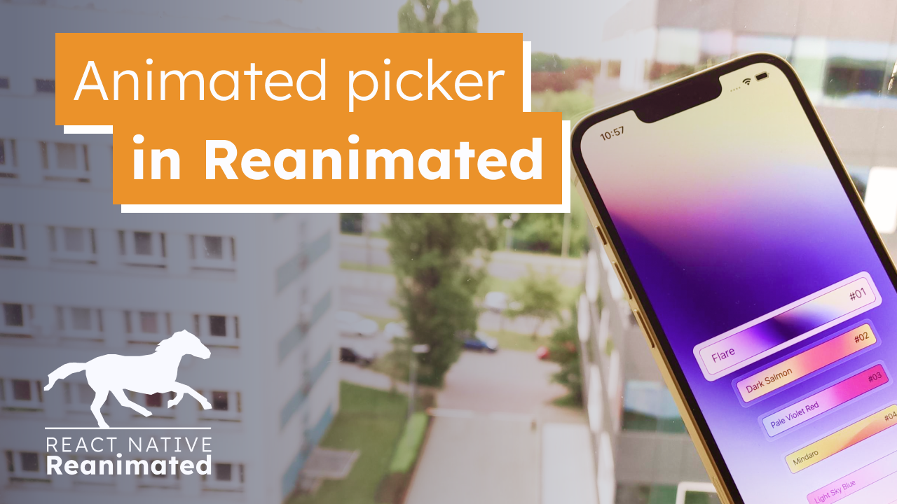

# Animated picker in reanimated.

Source code for the tutorial available here:
https://www.youtube.com/watch?v=_FehNLxxpRY&feature=youtu.be

---

Learn how to create an animated picker component in React Native using Reanimated, Gesture Handler, and Expo-Image.

We'll walk you through the steps of building the animation and UI components – from representing the animation in code to implementing the gesture and rendering UI components.

We'r create an engaging and interactive picker component. Watch now to add an animated touch to your React Native apps!

The full source code is available here:
https://github.com/aleqsio/gradient-picker-reanimated
